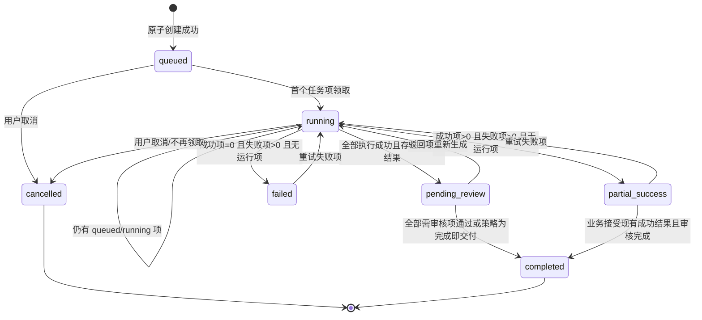
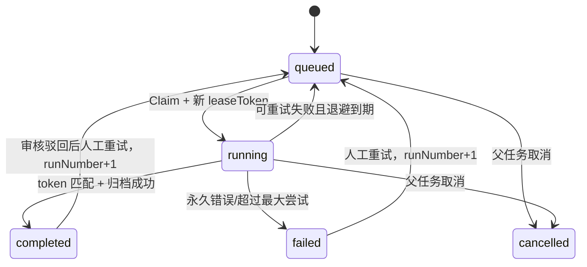
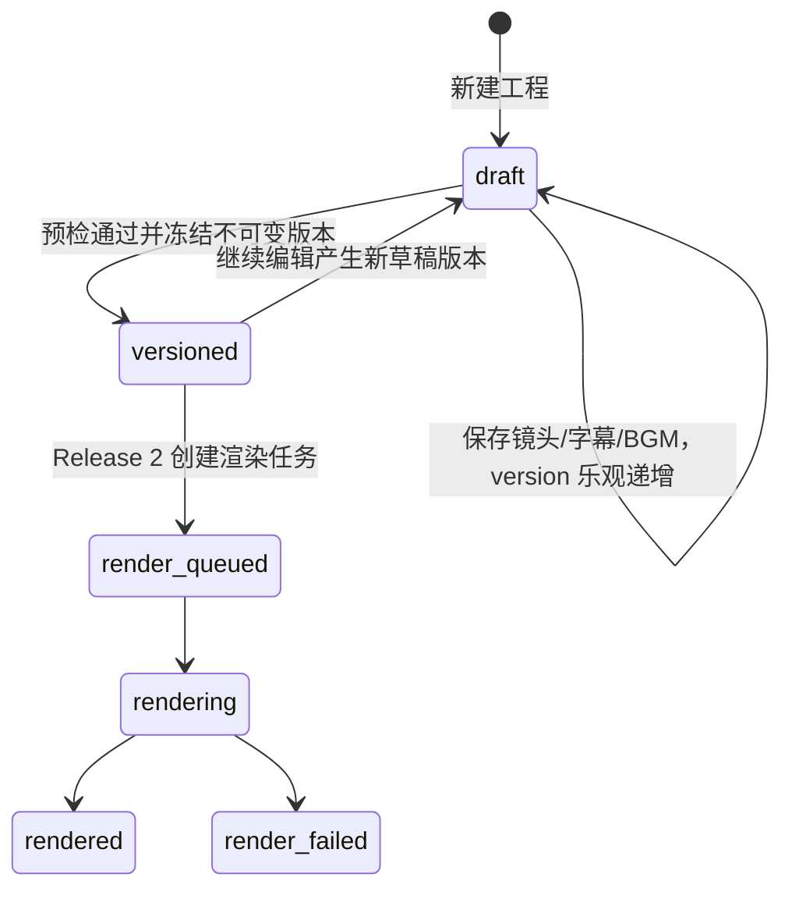
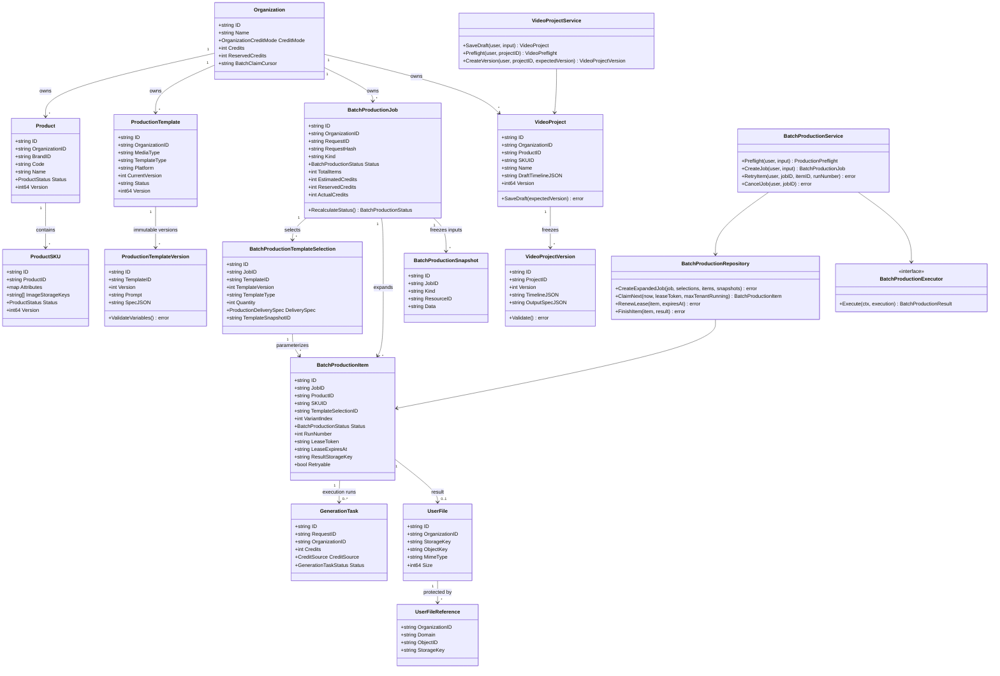
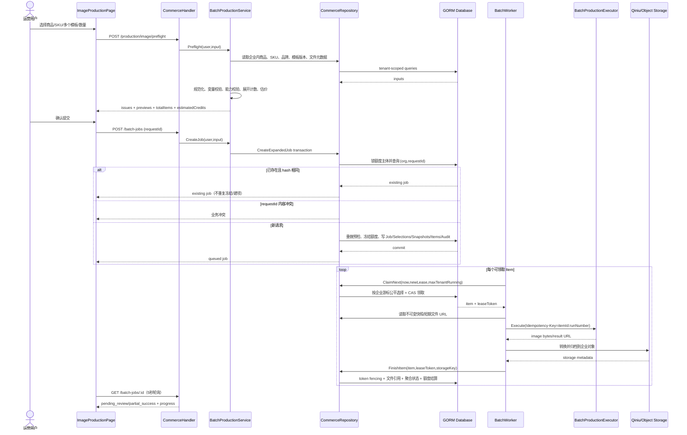
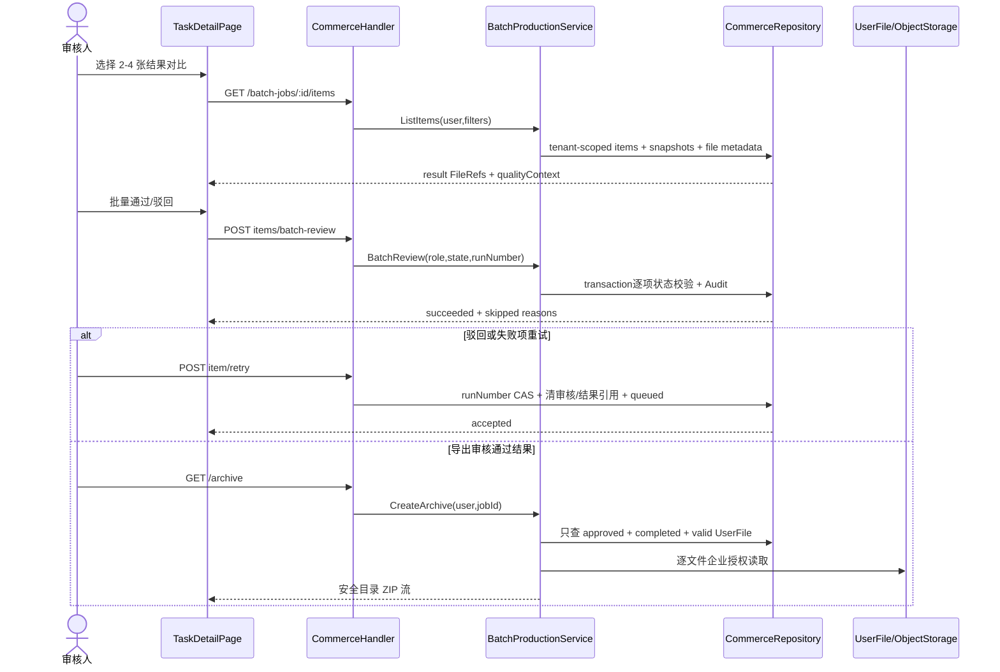
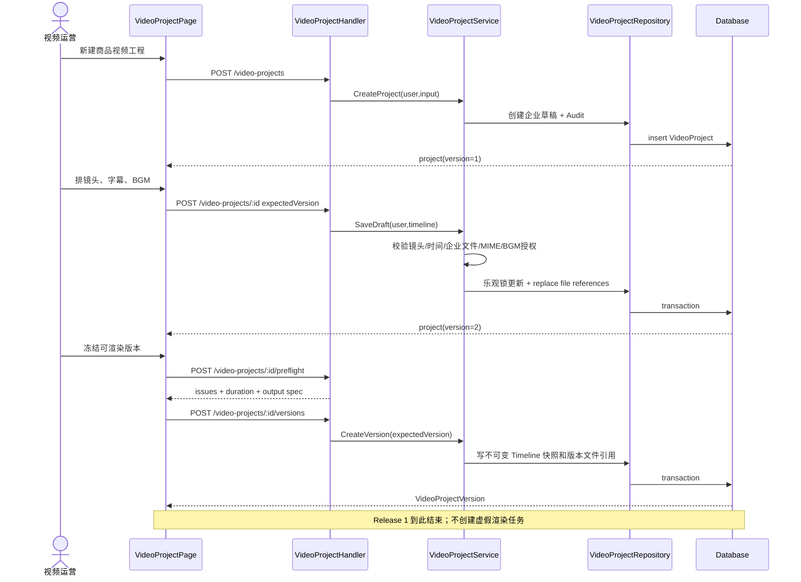
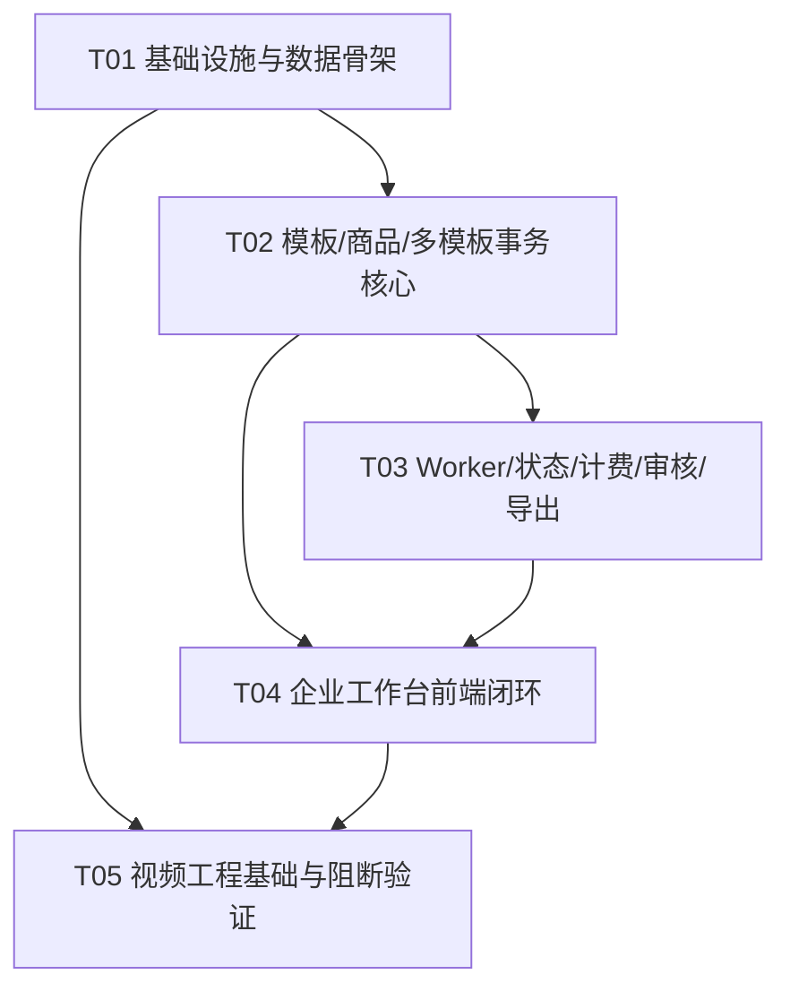

# 道生画境企业级电商生成平台增量架构与实施设计

- **设计人**：高见远（软件架构）
- **输入**：`artifacts/enterprise-ecommerce-prd.md`
- **约束基线**：根目录 `AGENTS.md`
- **改造方式**：沿用 Go + Gin + GORM 与 Next.js App Router + React + TypeScript + Ant Design + Tailwind + Zustand，增量扩展，不推倒重建
- **本轮目标**：可运行的 Release 1 图片企业生产闭环核心骨架，并落下可扩展的视频工程数据/API 基础；不虚假承诺本轮已完成视频渲染、全量运维指标和三期全部能力

---

## 1. 结论与实施边界

### 1.1 核心结论

现有项目已经具备企业、商品/SKU、模板版本、批量任务、独立 Worker、租约、企业公平领取、模型计费、七牛归档、事务型文件引用、审核、重试和同步 ZIP 导出。正确做法不是新建第二套“企业级任务系统”，而是：

1. 扩展现有 `ProductionTemplate(Version)` 的电商语义元数据；
2. 在现有 `BatchProductionJob/Item` 上增加“模板选择”和 `SKU × 模板 × 变体` 维度；
3. 保留现有 Worker、生成执行器、交付规格和文件归档边界；
4. 将现有 `/commerce` 巨型单页逐步拆成 `/commerce/*` 独立页面，共用企业上下文和 TanStack Query；
5. 新增视频工程/不可变工程版本，但本轮只持久化和预检，不把浏览器伪装成生产渲染器；真正的 FFmpeg/渲染 Worker 放 Release 2。

### 1.2 本轮明确交付（Release 1）

**P0-R1A，必须落地：**

- 商品列表独立页、商品详情/SKU 独立页；复用现有商品与企业文件 API。
- 图片模板电商元数据、不可变版本、内置/企业来源筛选、变量校验。
- 多商品/指定 SKU × 多模板 × 每模板数量的预检、预览、幂等创建与正确展开。
- 现有批量 Worker 对新任务项的执行、租约 fencing、公平调度、失败重试和结果归档。
- 图片任务中心与详情：进度、结果、审核、设主图、失败项重试、同步 ZIP 导出。
- 组织切换后的请求取消与缓存失效；所有 Query Key 带 `organizationId`。
- 相关多租户、幂等、租约、计费、文件引用回归测试与文档更新。

**P0-R1B，作为可扩展基础落地：**

- 视频工程与草稿时间线结构：镜头、基础转场、字幕段、BGM、输出规格。
- 工程草稿 CRUD、乐观锁、服务端素材引用校验、工程预检。
- “提交渲染生成不可变工程版本”的数据边界定义；本轮可创建版本快照，但不启动实际渲染任务。
- 前端视频工程基础页可编辑并保存草稿，明确显示“渲染能力将在 Release 2 接入”，不展示虚假完成态。

### 1.3 本轮明确不交付

- 不交付真正的 FFmpeg 拼接、交叉溶解、字幕烧录、BGM 混音和 MP4 成片；这要求独立视频 Worker、FFmpeg 运行时、资源隔离和压测。
- 不交付视频素材生成子项 DAG、最终合成依赖调度、视频扣费和成片审核。
- 不交付异步导出中心；Release 1 继续复用现有同步 ZIP，限制 2GB，并只导出审核通过且文件有效的图片。
- 不引入 Redis、Kafka、RabbitMQ 或新的微服务框架；现有数据库队列足够支撑 Release 1，避免无依据扩容复杂度。
- 不一次性删除 `/commerce`、`/image`、`/video`、`/canvas` 或迁移所有历史生成记录。
- 不实现 P1/P2 的导入、生产方案、ASR/TTS、通知、复杂 BI、平台直发。

---

## 2. 现状审计与可复用模块

| 能力 | 精确路径 | 现状判断与复用方式 |
|---|---|---|
| 企业、成员、角色、额度、审计 | `model/commerce.go`、`service/commerce.go`、`repository/commerce.go`、`handler/commerce.go` | 已有 Owner/Admin/Member/Reviewer 校验和企业过滤；新接口必须继续经 `EnsureOrganization`，不能信任前端实体 ID。 |
| 企业鉴权路由 | `router/router.go` | `/api/commerce` 已统一挂 `UserAuth + OrganizationAuth`；新增业务路由继续放在该 group。 |
| 商品/SPU、SKU、品牌 | `model/commerce.go`、`service/commerce.go:250-387`、`repository/commerce.go:437-693` | 已有分页、状态、版本冲突、企业唯一编码、SKU 最多 50 图和审计；只补筛选、详情、批量状态 API，不另建商品表。 |
| 模板和版本 | `model/commerce.go:224-267`、`service/commerce.go:389-445`、`repository/commerce.go:745-812` | 已有模板主表和不可变版本表，但版本只有 Prompt；在版本表扩展 `Spec`，内置模板仍由服务常量映射。 |
| 内置电商提示词 | `service/commerce.go:641-659`、`web/src/constant/commerce-presets.ts` | 主图/详情/场景/促销/SKU 等已存在；升级为带类型、平台、素材要求的统一只读模板 DTO。 |
| 交付规格与图片处理 | `service/delivery_specs.go` | 已有淘宝/京东/抖音/小红书规格及服务端裁切/格式转换；模板选择引用具体规格快照。 |
| 批量任务、快照、审核 | `model/commerce.go:293-421`、`service/commerce.go:447-619`、`repository/commerce.go:814-1203` | 已有幂等 RequestID/Hash、5000 项/企业 10000 待处理限制、输入快照、取消、失败/驳回重试、审核和主图；扩展模板选择维度与父状态。 |
| 独立批量 Worker | `cmd/batch-worker/main.go`、`service/batch_worker.go` | 已有并发、单企业并发、5 分钟租约、2 分钟续租、外部执行器接口；直接复用。 |
| 图片生成执行器/计费 | `service/batch_executor.go`、`service/generation_task.go`、`model/generation_task.go` | 已有上游选择、每任务项幂等键、生成任务扣费/失败退款；需增加任务创建前完整估价与额度保留语义，避免运行中才发现余额不足。 |
| 结果归档与文件引用 | `service/batch_worker.go:195-257`、`model/user_workspace.go:58-79`、`repository/user_workspace.go` | 已有 `UserFile + UserFileReference`，结果写入企业目录，持久化 `storageKey` 而非临时 URL；这是唯一文件真相源。 |
| ZIP 导出 | `service/batch_archive.go`、`handler/commerce.go:185-195` | 已验证企业过滤、审核状态、文件有效性、2GB 上限、安全文件名；扩展路径加入模板类型和变体序号，Release 1 保持同步。 |
| 运维健康与一致性 | `model/operations.go`、`service/operations.go`、`repository/operations.go`、`web/src/app/(admin)/admin/page.tsx` | 已有队列积压/过期租约、生成平均与 P95、文件/账本巡检；Release 1 补模板维度，无需新建监控系统。 |
| 前端企业 API | `web/src/services/api/commerce.ts`、`web/src/services/api/request.ts` | 已有统一 `{code,data,msg}` 解包和 `X-Organization-ID`；拆分类型/接口文件时保持 request 封装。 |
| 前端企业巨型页 | `web/src/app/(user)/commerce/page.tsx`、`web/src/app/(user)/commerce/components/batch-result-comparison.tsx` | 功能齐全但单页过载；抽取到独立路由，已有对比组件和表单逻辑可迁移，不重写视觉体系。 |
| 导航和企业切换 | `web/src/components/layout/app-top-nav.tsx`、`web/src/components/layout/organization-switcher.tsx`、`web/src/constant/navigation-tools.ts`、`web/src/app/(user)/layout.tsx` | 保留顶部栏；在 `/commerce/*` 增加业务侧栏，避免一次改动所有创作页面。 |
| 图片/视频快速创作 | `web/src/app/(user)/image/page.tsx`、`web/src/app/(user)/video/page.tsx` | 保留单次生成入口。现有视频页是“模型生成单条视频”，不能等同于后期编排器。 |
| 媒体上传/素材/画布回填 | `web/src/services/file-storage.ts`、`web/src/services/image-storage.ts`、`web/src/services/api/workspace.ts`、`web/src/stores/use-asset-store.ts`、`web/src/app/(user)/canvas/*` | 视频工程和商品详情继续使用服务端 StorageKey；不在 LocalStorage/IndexedDB 持久化账号业务数据。 |
| 数据库初始化 | `repository/db.go:66-100` | 项目使用 GORM AutoMigrate；新增模型同步加入 AutoMigrate，并更新数据库文档。企业并发生产使用 MySQL/PostgreSQL，不以 SQLite 做多 Worker 承诺。 |

### 2.1 当前实现必须修正的差距

1. `ListProducts` 只支持关键字和状态，缺品牌、类目和最近生产状态筛选/投影。
2. 当前批量创建只展开“商品所有 SKU”，且只有单 `Preset + DeliverySpec`，不支持指定 SKU、多模板和变体数量。
3. 当前父任务只有 queued/running/completed/failed/cancelled；混合成功/失败最终被标记 failed，不能表达部分成功和待审核。
4. 当前同步 ZIP 路径只到商品，模板多选后可能重名；必须加入模板类型/选择编号/变体。
5. 当前模板每次保存都生成新版本，但没有“元数据草稿”和发布变量校验；需要区分模板主表可变字段与不可变版本内容。
6. 当前计费在 Worker 执行项时发生，预检可估价，但无法保证“创建时额度够则全任务可被接受”；Release 1 必须引入额度保留或明确缩小验收。本文选择引入**任务级额度保留**，在事务内创建父任务并冻结预计额度，逐项执行从冻结额度结算，取消/终态释放未使用额度。
7. 当前 `CancelBatchProductionJob` 会把 running item 直接改 cancelled 并清租约；上游无法强制停止时可继续耗时，但旧执行者回写会因租约不匹配失败。保留此 fencing 行为，并在 UI 表述为“停止领取，运行中尽力取消”。
8. 当前视频页不保存可编辑时间线；必须新增服务端视频工程，不能把工程仅存在 React state。

---

## 3. 实现方案与架构模式

### 3.1 总体模式

- **后端**：保持分层模块化单体：Gin Handler（HTTP）→ Service（权限/校验/事务语义）→ Repository（GORM）→ MySQL/PostgreSQL/SQLite。长任务由独立 `cmd/batch-worker` 进程消费数据库队列。
- **前端**：Next.js App Router 页面 + TanStack Query 服务端状态 + Zustand 页面间临时向导状态。账号业务数据不持久化到浏览器。
- **一致性**：数据库事务是任务、项、快照、额度保留、审计的原子边界；对象存储由 `UserFile/UserFileReference` 记录所有权和引用。
- **扩展边界**：图片和未来视频共享“业务 Job/Item 展示语义”，但不强行将两种执行器塞入同一巨大函数。Release 1 继续使用 BatchProduction 表；Release 2 在同一 Task Center DTO 聚合 `BatchProductionJob` 和 `VideoRenderJob`。

### 3.2 框架/库选择

- 继续使用 `gin-gonic/gin`、`gorm.io/gorm`、现有 SQLite/MySQL/PostgreSQL driver。
- 图片交付继续使用 `github.com/disintegration/imaging`。
- 对象存储继续使用 `github.com/qiniu/go-sdk/v7`。
- 前端继续使用 Next 16、React 19、Ant Design 6、TanStack Query 5、Zustand 5、Tailwind 4、`lucide-react`。
- **Release 1 不新增第三方包**。模板变量解析只允许白名单占位符，使用 `strings`/正则和确定性替换，不引入通用模板执行引擎，避免执行型注入。
- Release 2 视频渲染优先调用容器内 `ffmpeg/ffprobe` 可执行文件或独立 HTTPS Renderer；Go 侧只负责编排、租约和归档，不引入不成熟的纯 Go 编解码库。

### 3.3 关键技术难点及策略

#### 多模板展开

请求使用规范化选择：

```json
{
  "requestId": "uuid-or-nanoid",
  "name": "春季上新图片包",
  "productScopes": [
    {"productId": "p1", "skuIds": ["s1", "s2"]},
    {"productId": "p2", "allActiveSkus": true}
  ],
  "templateSelections": [
    {"templateId": "product-main", "templateVersion": 1, "quantity": 2, "deliverySpecId": "taobao-main"},
    {"templateId": "carousel", "templateVersion": 3, "quantity": 2, "deliverySpecId": "jd-main"}
  ]
}
```

展开公式为：对每个有效 SKU，遍历模板选择，再遍历 `variantIndex=1..quantity`。无 SKU 的 SPU 只有在模板明确 `allowSpuWithoutSku=true` 时产生 SPU 项。任务创建前将 productScopes、templateSelections 排序去重并计算 canonical JSON SHA-256。示例验收 `2 SPU × 2 SKU × 3 模板 × 2 = 24`。

#### 幂等与计费

- 唯一键继续使用 `(organization_id, request_id)`；同键同 hash 返回原 Job，不重复建项、冻结额度或记审计；同键不同 hash 返回业务冲突。
- Item 的业务唯一键为 `(organization_id, job_id, product_id, sku_id, template_selection_id, variant_index)`；人工重试只增加 `run_number`，不创建重复业务项。
- 上游幂等键继续为 `batch:{itemId}:{runNumber}`。
- 创建事务内重复执行预检，锁定额度主体（个人或企业），增加 `reserved_credits`，创建 Job/Selections/Items/Snapshots/Audit；任一步失败全部回滚。
- Worker 开始某一 run 时，从 Job 未结算保留额度中结算该项；生成失败的既有退款逻辑只退款一次；取消/终态释放未消费保留额。账本关联 `GenerationTask.ID`，Job 记录 estimated/reserved/actual，严禁按前端估价扣费。

> 额度保留会触及账本核心，必须优先测试。若工程期不允许改账本，则应把“余额不足不得创建部分任务”降级为“创建时估价校验、运行时逐项扣费”，且不能宣称满足 PRD；不建议如此降级。

#### 租约与旧执行者 fencing

- Claim 必须将随机 `lease_token` 写入运行项；Renew/Finish 都使用 `id + org + job + status=running + lease_token` 条件更新。
- 租约到期后新 Worker 可接管并获得新 token；旧 Worker 即使后来完成，其 Finish 影响行数为 0，结果不得挂接到 Item，也不得重复结算。
- 归档 StorageKey 包含 `itemId + runNumber`；在最终挂接失败时，文件保持无引用并进入现有 GC 宽限期。
- 自动重试仅处理 transient 类错误，指数退避建议 10s/30s/2m/5m，最多 5 次；参数/素材缺失/内容违规为永久失败。Release 1 可先沿用当前租约重试次数，同时新增 `errorCode/retryable/nextAttemptAt`，避免通用错误文本驱动逻辑。

#### 跨企业公平调度

复用 `organizations.batch_claim_cursor` 和 `maxTenantRunning`：先按企业游标选择有 ready item 且运行数未达上限的企业，再按企业内 FIFO 选 item，领取后更新游标。Release 1 不引入优先级套餐。必须保持查询索引，并在 MySQL/PostgreSQL 双 Worker 测试；SQLite 仅本地单机。

#### 缓存失效

- Release 1 不增加服务端 Redis 缓存；数据库列表 + 合理索引优先，减少一致性面。
- TanStack Query Key 必须为 `['commerce', organizationId, resource, filters]`。
- 企业切换顺序：`cancelQueries({queryKey:['commerce', oldOrg]})` → 调切换接口 → 更新 active organization header → `removeQueries({queryKey:['commerce', oldOrg]})` → 拉新 workspace。
- 商品更新：失效当前企业 products、product detail、preflight；模板发布：失效 templates、preflight；任务变更：失效 jobs、job detail/items、workspace stats。
- 运行任务 5 秒轮询；父任务进入 `pending_review/partial_success/completed/failed/cancelled` 后停止高频轮询，手动刷新总是网络请求。
- 响应使用 `Cache-Control: private, no-store`。若 P1 引入服务端缓存，键必须包含 `organizationId + entityVersion`，禁止跨企业共享。

#### 统一文件引用和导出

- 持久化只存 `storageKey`，不存签名 URL；读取时通过企业鉴权的 `/api/workspace/files/:storageKey` 或服务端短期签名重新解析。
- 商品 SKU：`domain=sku`；批量输入：`batch_input`；批量结果：`batch_result`；视频草稿素材：新增 `video_project_draft`；视频版本素材：`video_project_version`；未来成片：`video_render_result`。
- `replaceUserFileReferences` 与实体保存处在同一 DB 事务；引用存在时 GC 不能删。
- Release 1 ZIP 只包含 `completed + approved + 有 UserFile`，目录：`{SPU}/{SKU-or-SPU}/{templateType}/`，文件：`{SPU}_{SKU}_{templateType}_{variant}_{itemSuffix}.{ext}`，所有片段经现有安全清洗，Item 后缀保证不覆盖。
- 同步 ZIP 继续限制 2GB、10 分钟下载超时和临时文件清理；大包异步化属于 Release 3/P1。

---

## 4. 数据模型与状态机

### 4.1 Release 1 模型增量

#### 模板

- `ProductionTemplate`：保留主表；增加 `Source(builtin|organization)`（内置模板实际上由 DTO 合并，不必入库）、`MediaType(image|video)`、`TemplateType(main|carousel|detail|scene|promotion|sku_series|custom)`、`Platform`、`Status(draft|active|disabled)`。
- `ProductionTemplateVersion`：不可变；增加 `SpecJSON`，内容含宽高/格式/质量、默认数量、素材要求、变量白名单、文案区/背景要求、输出命名规则。历史版本不更新、不删除。
- 为最小变更保留 `Prompt` 字段；旧企业模板 `SpecJSON` 为空时服务层映射为 `image/custom/original/quantity=1`。

#### 图片批量

- `BatchProductionTemplateSelection`（新增）：某 Job 选中的模板版本、数量、交付规格快照和模板快照 ID。
- `BatchProductionJob`（扩展）：`Kind=image_pack`、估价/保留/实际额度、排队/完成计数、显示状态；原 `Preset*`/`DeliverySpec` 字段只供旧单模板记录兼容读取，新任务以 selections 为准。
- `BatchProductionItem`（扩展）：`TemplateSelectionID`、`TemplateID`、`TemplateVersion`、`TemplateType`、`VariantIndex`、`ErrorCode`、`Retryable`、`NextAttemptAt`、`EstimatedCredits`。结果仍用 `ResultStorageKey`。
- `BatchProductionSnapshot`：继续保存 brand/product/sku；新增 `template` 与 `request` 快照，单 Job 总量仍限制 16MB。

#### 视频工程基础

- `VideoProject`：企业内可变草稿根，含产品/SKU、名称、草稿 Timeline JSON、乐观版本、状态和审计字段。
- `VideoProjectVersion`：点击“冻结版本/准备渲染”时创建的不可变快照，含工程版本号、Timeline JSON、输出规格、素材文件引用，未来 render job 永远指向它。
- Timeline schema 由服务端验证：`shots[]`、`subtitles[]`、`bgm?`、`output`。镜头 ID 在工程内唯一；字幕时间范围必须落在总时长；素材必须是本企业有效 `UserFile`。
- 本轮不创建 `VideoRenderJob` 表。Release 2 新增该表和 `VideoRenderItemDependency`，避免未落地渲染器时出现永远 queued 的假任务。

### 4.2 父任务状态



父状态由 Item 聚合计算，不允许 Handler 任意写。`cancelled` 保留已完成结果；对正在上游执行的项是尽力停止，旧租约结果不能回写。

### 4.3 任务项状态



审核状态与执行状态正交：`none/pending/approved/rejected`。completed 才可进入 pending；rejected 不能设主图；人工重试清空旧审核并解除旧结果引用。

### 4.4 视频工程状态



Release 1 的可达状态止于 `versioned`；`render_*` 是 Release 2 契约，不在本轮 UI 伪造。

### 4.5 类图



---

## 5. API 设计

### 5.1 通用规则

- 业务响应统一：`{"code":0,"data":...,"msg":""}`；失败仍返回 `code != 0` 与可行动中文 `msg`。
- 认证沿用 Cookie/Bearer；企业上下文沿用 `X-Organization-ID`，服务端还必须用登录用户 membership 复核。
- 列表沿用 `model.Query` 的 `page/pageSize/keyword/type`，新增业务筛选参数在 Handler 显式解析，响应 `{items,total}`。
- 所有时间继续用 UTC RFC3339 字符串；所有修改接口做服务端权限、状态和乐观版本校验。
- 创建批量任务的 `requestId` 必填；客户端在一次向导会话首次提交时生成并复用，用户修改请求内容后生成新 ID。

### 5.2 商品接口

| Method | Path | 说明 |
|---|---|---|
| GET | `/api/commerce/products` | 扩展 `brandId/category/status/keyword/page/pageSize`；返回 SKU 数、最近任务状态。 |
| GET | `/api/commerce/products/:id` | 新增详情，含品牌摘要、SKU 统计，不默认返回全部 SKU。 |
| POST | `/api/commerce/products` | 复用新增/编辑与版本冲突。 |
| POST | `/api/commerce/products/batch-status` | 新增，最多 200 项，逐项校验并返回 succeeded/skipped。 |
| DELETE | `/api/commerce/products/:id?expectedVersion=` | 复用；被任务引用时不可物理删除，UI 默认停用。 |
| GET/POST/DELETE | `/api/commerce/products/:id/skus`、`/api/commerce/skus`、`/api/commerce/skus/:id` | 复用并在详情页承载。 |

批量状态请求/响应：

```json
{"items":[{"id":"p1","expectedVersion":2},{"id":"p2","expectedVersion":4}],"status":"paused"}
```

```json
{"code":0,"data":{"succeeded":["p1"],"skipped":[{"id":"p2","reason":"版本已变化"}]},"msg":""}
```

### 5.3 模板接口

| Method | Path | 说明 |
|---|---|---|
| GET | `/api/commerce/production-templates` | 合并内置和企业模板；筛选 `source/mediaType/templateType/platform/status`。 |
| GET | `/api/commerce/production-templates/:id` | 当前版本详情。 |
| POST | `/api/commerce/production-templates` | 保存主表元数据；草稿可编辑。 |
| POST | `/api/commerce/production-templates/:id/publish` | 校验变量/规格后生成不可变新版本。 |
| GET | `/api/commerce/production-templates/:id/versions` | 复用并返回 Spec。 |
| POST | `/api/commerce/production-templates/preview` | 扩展现有预览，返回 Prompt、引用图、规格和警告。 |

模板变量仅允许：`product.name`、`product.category`、`product.description`、`product.sellingPoints`、`product.targetAudience`、`sku.name`、`sku.code`、`sku.attributes.*`、`brand.name`、`brand.tone`、`brand.guidelines`、`brand.prohibitedTerms`。未知变量阻止发布；不执行函数、循环和任意表达式。

### 5.4 图片生产接口

#### 预检

`POST /api/commerce/production/image/preflight`

请求使用 3.3 的 `productScopes/templateSelections`，可附 `previewSkuId`。响应：

```json
{
  "code": 0,
  "data": {
    "normalizedInput": {"productScopes": [], "templateSelections": []},
    "skuCount": 4,
    "templateCount": 3,
    "totalItems": 24,
    "estimatedCredits": 240,
    "canSubmit": false,
    "issues": [
      {"severity":"error","code":"REFERENCE_REQUIRED","productId":"p1","skuId":"s2","templateId":"product-main","field":"imageStorageKeys","message":"该 SKU 缺少主图模板要求的参考图"}
    ],
    "previews": [
      {"skuId":"s1","templateId":"product-main","templateVersion":1,"prompt":"...","referenceFiles":[{"storageKey":"image:...","mimeType":"image/png","size":123}],"deliverySpec":{"id":"taobao-main","width":800,"height":800}}
    ]
  },
  "msg": ""
}
```

#### 创建

`POST /api/commerce/batch-jobs` 保留路径并升级 body；服务端必须在事务内重做预检，不能接受前端传入的 estimatedCredits。响应立即返回 Job，不等待图片生成。

#### 查询/操作

- `GET /api/commerce/batch-jobs?kind=image_pack&status=...`
- `GET /api/commerce/batch-jobs/:id`（新增父任务、selections、聚合进度、快照摘要）
- `GET /api/commerce/batch-jobs/:id/items?templateType=&reviewStatus=&status=`
- `POST /api/commerce/batch-jobs/:id/cancel`
- `POST /api/commerce/batch-jobs/:id/retry`（只重试失败项）
- `POST /api/commerce/batch-jobs/:id/items/:itemId/retry`
- `POST /api/commerce/batch-jobs/:id/items/:itemId/review`
- `POST /api/commerce/batch-jobs/:id/items/:itemId/primary`
- `POST /api/commerce/batch-jobs/:id/items/batch-review`（新增，返回 succeeded/skipped）
- `POST /api/commerce/batch-jobs/:id/items/batch-retry`（新增，返回 succeeded/skipped）
- `GET /api/commerce/batch-jobs/:id/archive`（保留同步下载）

### 5.5 统一任务中心 DTO

Release 1 的任务中心只聚合图片 Job 与现有单次 GenerationTask 的只读摘要；操作能力仍按 source 分发，避免数据表强行合并。

`GET /api/commerce/tasks?kind=image_pack|single_image|single_video&status=&creatorId=&productId=&from=&to=` 返回：

```json
{
  "items": [{
    "id":"batch-1","source":"batch_production","kind":"image_pack","name":"春季上新",
    "displayStatus":"partial_success","progress":{"total":24,"queued":0,"running":0,"succeeded":22,"failed":2},
    "creator":{"id":"u1","name":"张三"},"productSummary":{"count":2,"names":["商品A"]},
    "estimatedCredits":240,"actualCredits":220,"createdAt":"...","completedAt":"..."
  }],
  "total": 1
}
```

单次 GenerationTask 没有商品/审核/导出能力时字段为空，前端不可展示无效按钮。Release 2 再把 `video_render` 作为第三种 source 加入。

### 5.6 视频工程基础接口

| Method | Path | Release 1 行为 |
|---|---|---|
| GET | `/api/commerce/video-projects` | 企业隔离分页。 |
| POST | `/api/commerce/video-projects` | 新建空工程或基于商品/SKU 新建。 |
| GET | `/api/commerce/video-projects/:id` | 返回草稿 Timeline 和可解析 FileRef。 |
| POST | `/api/commerce/video-projects/:id` | 保存草稿，要求 `expectedVersion`；替换文件引用。 |
| POST | `/api/commerce/video-projects/:id/preflight` | 校验素材、时长、比例、字幕安全区、BGM 授权确认。 |
| POST | `/api/commerce/video-projects/:id/versions` | 预检通过后冻结不可变版本。 |
| GET | `/api/commerce/video-projects/:id/versions` | 历史版本只读。 |

Release 2 才增加 `POST /video-projects/:id/renders`。本轮不得返回一个永远无法执行的 queued render job。

---

## 6. 关键调用时序

### 6.1 多模板图片预检、幂等创建、Worker 执行



### 6.2 审核、失败项重试与导出



### 6.3 视频工程草稿与版本冻结（本轮真实边界）



---

## 7. 视频工程、镜头、字幕、BGM 与渲染任务边界

### 7.1 Timeline 契约

```ts
VideoTimeline = {
  shots: Array<{
    id: string;
    source: { storageKey: string; kind: "image" | "video"; sourceType: "sku" | "asset" | "upload" | "generated" };
    startMs: number;
    durationMs: number;
    trimStartMs: number;
    cropMode: "cover" | "contain";
    transitionToNext: { type: "none" | "fade" | "cross_dissolve"; durationMs: number };
  }>;
  subtitles: Array<{ id: string; text: string; startMs: number; endMs: number; style: "default" | "light" | "dark"; positionY: number }>;
  bgm?: { storageKey: string; volume: number; loop: boolean; trimStartMs: number; fadeInMs: number; fadeOutMs: number; rightsConfirmed: boolean };
  output: { ratio: "16:9" | "9:16" | "1:1"; width: number; height: number; fps: 30; format: "mp4"; videoCodec: "h264"; audioCodec: "aac" };
}
```

服务端是最终验证者：3–100 镜头、15–60 秒建议范围、转场不长于相邻镜头、字幕不越界、`positionY` 在安全区、BGM 是企业音频且确认授权。浏览器预览只用于编排反馈，不是最终渲染真相。

### 7.2 Release 2 渲染边界（本轮只设计）

- `VideoRenderJob` 指向不可变 `VideoProjectVersion`。
- `VideoRenderItem` 分为 `shot_generate`（可选 AI 镜头）和 `compose`；`compose` 依赖所有 required shot item。
- 依赖必须由显式 `VideoRenderItemDependency` 表表达，不能靠字符串状态猜测。
- Video Worker 使用与图片一致的租约 token/fencing/续租；但拥有独立并发配置，防止 CPU/临时磁盘任务挤占图片 Worker。
- Renderer 输入为本地临时文件或授权短链；输出必须归档为 `UserFile` 后才能 completed。
- FFmpeg 推荐通过独立容器/进程执行，限制 CPU、内存、输入时长/像素、临时目录和命令白名单；绝不把用户文本拼进 shell。
- 合成重试只重跑 compose，不重复已完成的 AI 镜头，也不重复计费。

### 7.3 本轮页面可做到的真实程度

可做到：添加企业/商品素材、镜头排序、时长、三种转场配置、字幕分段与基础安全区预览、BGM 参数、服务端保存、刷新恢复、预检、冻结版本。

做不到且必须禁用：生成最终 MP4、声画精确预览、字幕实际字体渲染一致性、跨浏览器编解码一致性。按钮应标为“保存并冻结版本”，并通过提示说明渲染服务未启用；不能标“生成成功”。

---

## 8. 前端路由、页面与共享组件规划

### 8.1 路由

| 路由 | 本轮职责 |
|---|---|
| `/commerce` | 兼容入口/企业工作台摘要；逐步移除巨型 Tab，但不删除旧能力。 |
| `/commerce/products` | 商品高密度列表、筛选、批量状态、加入图片生产。 |
| `/commerce/products/[id]` | 商品基础信息、SKU/参考图、历史任务。 |
| `/commerce/production/images` | 四步图片生产向导；可接收 `productIds` 查询参数预填。 |
| `/commerce/templates` | 图片模板列表、筛选、版本详情/发布。 |
| `/commerce/tasks` | 图片任务为主的统一只读列表；单次生成作为兼容摘要。 |
| `/commerce/tasks/[id]` | 图片 Job 详情、结果、对比、审核、重试、导出。 |
| `/commerce/video-projects` | 视频工程列表。 |
| `/commerce/video-projects/[id]` | 视频工程基础编辑与冻结版本。 |
| `/image` `/video` `/canvas` | 完全保留既有快速创作入口；`/video` 不冒充工程页。 |

### 8.2 布局

- 保留 `AppTopNav`，新增 `web/src/app/(user)/commerce/layout.tsx`，仅对企业工作台提供 220–240px 可折叠侧栏；1280px 下可收起。
- 不一次改变画布页主题与顶部栏行为。
- 页面标题/筛选/主操作位置统一；表格使用 Ant Design sticky/fixed column 和横向滚动。
- 侧栏展开状态可放内存 Zustand；若需要跨会话，只能作为非账号 UI 偏好经服务端 preference 保存，不能 LocalStorage。

### 8.3 状态管理

- TanStack Query 管所有服务端列表/详情；不复制到 Zustand。
- `use-image-production-store.ts` 只保存当前页面生命周期内的向导草稿、规范化选择和 requestId，使用 `persist` 中间件是禁止的。
- 视频编辑页优先同目录 hook + reducer/Zustand 管未保存编辑状态；服务端保存后以返回 version 为准。
- 共享 Query Key 工厂集中在 `services/api/commerce-query-keys.ts`，强制带 organizationId。

### 8.4 共享组件

- `commerce/components/commerce-shell.tsx`：侧栏与内容框架；不是只转发 children，负责折叠、选中和移动端 Drawer。
- `commerce/components/commerce-page-header.tsx`：统一页面标题、说明、主操作。
- `commerce/components/task-status-tag.tsx`、`task-progress.tsx`：统一状态文案/色/图标。
- `commerce/components/file-preview.tsx`：以 storageKey 获取当前企业文件，不缓存签名 URL。
- 页面私有表单/表格组件放各自 `components/`，遵守 AGENTS.md，不建泛化程度过高的组件库。

---

## 9. 新增/修改文件清单

### 9.1 后端修改

- `config/config.go`：增加视频工程/未来渲染开关（本轮默认关闭）、图片队列退避/额度保留必要配置；不改变现有默认启动。
- `model/commerce.go`：扩展模板、Job/Item 状态与字段，新增模板选择 DTO/预检 DTO。
- `model/user.go`：个人额度保留字段（若个人扣费模式）。
- `model/operations.go`：可选增加 partial/pending-review 和保留额度异常摘要。
- `repository/db.go`：AutoMigrate 新模型。
- `repository/commerce.go`：多模板选择、预检批量查询、原子展开、额度保留、聚合状态、筛选、批量审核。
- `service/commerce.go`：保留企业/商品入口，拆分后仅留兼容 facade 或公共权限函数。
- `service/batch_executor.go`：按 Item 对应模板快照生成 Prompt/规格，不再使用 Job 单 Preset。
- `service/batch_worker.go`：处理 Retryable/NextAttemptAt、选择快照、额度保留结算。
- `service/batch_archive.go`：模板目录/变体安全命名。
- `handler/commerce.go`：新增商品详情、预检、Job 详情、批量动作 handler。
- `router/router.go`：注册新增路由。
- `repository/operations.go`、`service/operations.go`：任务状态和额度保留巡检。

### 9.2 后端新增

- `model/video_project.go`：VideoProject、VideoProjectVersion、Timeline DTO。
- `repository/video_project.go`：企业隔离 CRUD、乐观锁、版本快照、文件引用。
- `service/video_project.go`：Timeline/素材/MIME/时长/授权预检。
- `handler/video_project.go`：薄 Handler。
- `service/production_preflight.go`：规范化、模板变量、展开计数、估价和 Preview；避免继续膨胀 `service/commerce.go`。
- `service/production_template.go`：模板 Spec、内置模板 DTO、变量校验/发布。

### 9.3 前端修改

- `web/src/app/(user)/commerce/page.tsx`：收敛为兼容工作台/导航，移出高频模块。
- `web/src/app/(user)/layout.tsx`：保护 `/commerce/*`、不改变现有创作入口。
- `web/src/components/layout/app-top-nav.tsx`：企业工作台导航激活兼容，不重做全局主题。
- `web/src/constant/navigation-tools.ts`：企业中心入口文案/分组。
- `web/src/services/api/commerce.ts`：保留兼容导出，逐步转发到拆分 API 文件。
- `web/src/components/layout/organization-switcher.tsx`：按规定取消/清除旧企业 Query。

### 9.4 前端新增

- `web/src/app/(user)/commerce/layout.tsx`
- `web/src/app/(user)/commerce/components/commerce-shell.tsx`
- `web/src/app/(user)/commerce/components/task-status-tag.tsx`
- `web/src/app/(user)/commerce/products/page.tsx`
- `web/src/app/(user)/commerce/products/[id]/page.tsx`
- `web/src/app/(user)/commerce/products/[id]/components/sku-editor.tsx`
- `web/src/app/(user)/commerce/production/images/page.tsx`
- `web/src/app/(user)/commerce/production/images/components/template-step.tsx`
- `web/src/app/(user)/commerce/production/images/components/preflight-step.tsx`
- `web/src/app/(user)/commerce/production/images/use-image-production-store.ts`
- `web/src/app/(user)/commerce/templates/page.tsx`
- `web/src/app/(user)/commerce/templates/components/template-editor.tsx`
- `web/src/app/(user)/commerce/tasks/page.tsx`
- `web/src/app/(user)/commerce/tasks/[id]/page.tsx`
- `web/src/app/(user)/commerce/tasks/[id]/components/result-review.tsx`
- `web/src/app/(user)/commerce/video-projects/page.tsx`
- `web/src/app/(user)/commerce/video-projects/[id]/page.tsx`
- `web/src/app/(user)/commerce/video-projects/[id]/components/timeline-editor.tsx`
- `web/src/services/api/commerce-products.ts`
- `web/src/services/api/commerce-production.ts`
- `web/src/services/api/video-projects.ts`
- `web/src/services/api/commerce-query-keys.ts`

### 9.5 测试与文档

- 修改 `repository/batch_production_test.go`、`service/batch_worker_test.go`、`service/batch_executor_test.go`、`router/batch_jobs_test.go`、`router/production_templates_test.go`、`router/commerce_catalog_test.go`。
- 新增 `service/production_preflight_test.go`、`repository/video_project_test.go`、`router/video_projects_test.go`。
- 修改 `docs/content/docs/backend/backend-database.mdx`、`docs/content/docs/backend/api-response.mdx`、`docs/content/docs/progress/todo.mdx`、`docs/content/docs/progress/pending-test.mdx`；实际变更完成后才记录 pending-test。

---

## 10. 有序任务列表（不超过 5 个，按依赖）

### T01：项目基础设施、配置与数据骨架（P0）

- **Source Files**：`config/config.go`、`repository/db.go`、`router/router.go`、`model/commerce.go`、`model/video_project.go`、`go.mod`、`web/package.json`、数据库文档。
- **Dependencies**：无。
- **内容**：在不新增第三方包的前提下注册新模型/路由骨架；增加模板选择、批量字段/索引、视频工程模型、额度保留字段；维护旧字段兼容读取；确认 `go.mod`/`package.json` 无新增依赖。
- **验收**：三种数据库 AutoMigrate 设计无冲突；唯一键覆盖幂等和业务项；所有新表有 organization_id；路由仍挂企业中间件；旧路由保留；数据库文档同步。

### T02：模板、商品查询与多模板任务事务核心（P0）

- **Source Files**：`service/production_template.go`、`service/production_preflight.go`、`service/commerce.go`、`repository/commerce.go`、`handler/commerce.go`、`model/commerce.go`、相关 router/repository/service tests。
- **Dependencies**：T01。
- **内容**：实现模板 Spec/变量白名单/发布版本；商品扩展筛选与详情/批量状态；预检、预览、估价；事务内重检、额度冻结、Selections/Snapshots/Items 展开和 request hash 幂等。
- **验收**：2×2×3×2 正确为 24；同 requestId 同内容仅一 Job/24 Item/一次保留，不同内容冲突；指定 SKU 生效；缺图定位到 SKU+模板；超过 200 商品/5000 项/16MB 快照/企业 10000 队列均阻止；v1 任务不受 v2 发布影响；跨企业 ID 全拒绝。

### T03：Worker、状态机、计费、审核与统一文件导出（P0）

- **Source Files**：`service/batch_worker.go`、`service/batch_executor.go`、`service/batch_archive.go`、`service/generation_task.go`、`repository/commerce.go`、`repository/operations.go`、`service/operations.go`、相关 tests。
- **Dependencies**：T02。
- **内容**：执行 Selection 快照；父状态聚合；租约续租/fencing；可重试分类和退避；冻结额度逐项结算/释放；批量审核/重试；模板目录安全 ZIP；运维统计/巡检。
- **验收**：双 Worker 同 Item 不重复；过期接管后旧 token 回写失败；单企业大队列不饿死另一企业；成功项重试不执行；失败退款/冻结释放仅一次；结果必有 batch_result 引用；导出只含 approved 有效文件且不重名/无路径穿越；取消后不再领取且保留成功结果。

### T04：Release 1 企业工作台前端闭环（P0）

- **Source Files**：`web/src/app/(user)/commerce/layout.tsx`、`products/page.tsx`、`products/[id]/page.tsx`、`production/images/page.tsx` 及其至少三个私有组件/store、`templates/page.tsx`、`tasks/page.tsx`、`tasks/[id]/page.tsx`、拆分后的 commerce API/query keys、组织切换组件。
- **Dependencies**：T02；任务详情完整能力依赖 T03，可先使用 DTO mock/type 开发但集成后验收。
- **内容**：企业侧栏、商品独立页、四步图片向导、模板中心、任务列表/详情/对比审核/导出；所有查询带企业 ID；5 秒条件轮询；旧 `/commerce` 兼容入口。
- **验收**：1280×720 和 1440×900 主流程无遮挡；浅深主题可读；Member/Reviewer 按权限显示且服务端仍拦截；切企业后旧轮询取消、旧缓存清除；双击提交复用 requestId；完成后停止轮询；不使用浏览器持久化账号业务数据；既有 `/image` `/video` `/canvas` 可访问。

### T05：视频工程可扩展基础与发布阻断验证（P1，本轮不含渲染）（P0 风险门）

- **Source Files**：`model/video_project.go`、`repository/video_project.go`、`service/video_project.go`、`handler/video_project.go`、`router/router.go`、`web/src/services/api/video-projects.ts`、`video-projects/page.tsx`、`video-projects/[id]/page.tsx`、`timeline-editor.tsx`、相关 tests/docs。
- **Dependencies**：T01；可与 T02/T03 并行，最终依赖 T04 的 shell。
- **内容**：工程草稿/乐观锁/文件引用/预检/不可变版本；基础时间线编辑和安全区预览；明确禁用真实渲染；完成租户、存储、Worker、计费、多数据库发布阻断验证清单。
- **验收**：刷新后工程可恢复；跨企业素材不可引用；修改冲突不静默覆盖；版本冻结后不可修改；草稿替换正确更新文件引用；不创建假 render job；UI 不宣称生成 MP4；文档明确 FFmpeg/Renderer 是 Release 2 依赖。

### 10.1 任务依赖图



---

## 11. 依赖包与运行约束

### 11.1 已有且继续使用

- `github.com/gin-gonic/gin@v1.11.0`：HTTP 路由/中间件。
- `gorm.io/gorm@v1.31.1`：事务、乐观更新和数据库访问。
- `gorm.io/driver/mysql@v1.6.0`、`gorm.io/driver/postgres@v1.6.0`、`github.com/glebarez/sqlite@v1.11.0`：数据库。
- `github.com/qiniu/go-sdk/v7@v7.26.16`：企业私有对象存储。
- `github.com/disintegration/imaging@v1.6.2`：图片交付转换。
- `next@16.2.3`、`react@19.2.5`、`typescript@^5`。
- `antd@^6.4.2`、`@tanstack/react-query@^5.100.9`、`zustand@^5.0.12`、`tailwindcss@^4`、`lucide-react@^1.16.0`。

**Release 1 新增包：无。**

### 11.2 运行约束

- Go 版本沿用 `1.25.0`；Node 版本应满足 Next 16 当前要求，以项目现有构建环境为准。
- API 与 `batch-worker` 必须共享同一 MySQL/PostgreSQL 和对象存储配置；多实例企业生产不使用 SQLite。
- 七牛配置是结果归档/导出的发布前置；Docker 静态资源路径仍是项目待验收项，本文不宣称已生产验证。
- 图片 Worker 现有默认并发 4、单企业 2；压测前不盲目提高。5000 项是请求上限，不是推荐常规单量。
- 视频 Release 2 运行时需 FFmpeg/ffprobe（建议固定 6.x/7.x 镜像版本）、独立临时磁盘和并发限制；Release 1 无此运行依赖。
- 所有上游 Base URL/API Key 仅服务端保存；用户端只访问同源 `/api/*` 与 `/api/v1/*`。
- 不执行浏览器离线 outbox，不把工程、任务、文件或偏好写 LocalStorage/IndexedDB。

---

## 12. Shared Knowledge（工程共识）

- 所有业务响应使用 `{code,data,msg}`；前端只通过 `services/api/*` 调用。
- 所有业务表和查询首先限定 `organization_id`；实体 ID 不是授权凭据。
- 时间使用 UTC RFC3339；金额/算力使用整数，不使用浮点。
- 模板版本、任务输入快照、视频工程版本一旦被任务引用即不可变。
- `storageKey` 是持久化文件引用；签名 URL/Blob URL 只是短期视图，不可入库。
- Item 的 stable identity 不随重试改变，`runNumber` 区分执行轮次；上游幂等键包含两者。
- Finish/Renew 必须带 leaseToken CAS；任何不带 token 的“管理员完成任务”接口都禁止。
- 父任务状态由子项聚合，成功结果不因部分失败回滚。
- TanStack Query key 必带 organizationId；企业切换先取消请求再清旧缓存。
- Zustand 只存页面内临时交互状态，不复制服务端列表，不启用 persist。
- Handler 只解码/调用/OK-Fail；Service 做权限与业务；Repository 只做 GORM。
- Release 1 不增加 Redis/消息队列/微服务；先让数据库队列的幂等、租约、索引和恢复通过真实验收。

---

## 13. 风险、发布门槛与待确认事项

### 13.1 高风险

1. **额度保留改造**：涉及个人/企业共享账本并发，错误会重复扣费或透支。必须覆盖同请求并发、取消、Worker 崩溃、退款、预算跨月；建议 T02/T03 最高优先级。
2. **GORM AutoMigrate 与现有字段兼容**：新增非空字段须有安全默认；旧单模板 Job 兼容读仅做最小映射。按 AGENTS.md 项目未上线可直接调整结构，但不能破坏当前测试数据工作流。
3. **多数据库锁语义**：现有公平 Claim 的子查询/行锁必须在 MySQL/PostgreSQL 双 Worker 实测；SQLite 结果不代表生产并发。
4. **现有发布阻断项**：多租户、七牛回源、备份恢复、真实上游、对象 GC 和 Docker 路径尚未全部验收；新增页面不等于生产可用。
5. **同步 ZIP**：2GB 大包仍占临时磁盘和请求时长；Release 1 必须清理临时文件并清晰报超限，规模增长后转异步。
6. **视频预览误差**：浏览器 CSS/HTML 预览不能保证 FFmpeg 成片一致；本轮必须标“编排预览”，Release 2 以 Renderer 输出为准。
7. **BGM 授权**：本轮只允许企业自有上传并记录 `rightsConfirmed`；不内置来源不明曲库。
8. **AGPL-3.0**：商业部署与原作者标识需要独立合规审查。

### 13.2 发布阻断验收

- 两企业/两账号伪造 Header、商品 ID、模板 ID、Job ID、storageKey 全部拒绝。
- 并发重复创建只产生一次任务/项/额度保留。
- Worker 进程终止、租约过期、旧 Worker 晚回写不会覆盖。
- 上游 429/超时/永久参数错误进入正确重试/终态。
- 计费消费、退款、保留、释放账本能一致性巡检。
- 七牛临时 URL 过期后仍能通过 storageKey 访问归档结果。
- 引用中的文件不会被 GC；无引用失败归档最终可清理。
- MySQL/PostgreSQL 至少各完成一次核心仓储/路由测试；SQLite 只作为本地便捷模式。

### 13.3 待业务/运维确认（默认值）

1. 审核是否强制：默认生成成功进入待审核，仅 approved 进入标准批量导出。
2. 额度保留时机：默认任务创建时全额冻结估价，实际按项结算，取消释放剩余。
3. 商品无 SKU 是否允许生产：默认仅模板声明 `allowSpuWithoutSku` 时允许。
4. 模板变体数量：默认 1，单选择建议上限 10，总项上限仍 5000。
5. 模板状态：建议 `draft/active/disabled`；已发布版本只读。
6. 详情图 P0 形式：有序分段图，不做长图拼接。
7. ZIP 导出同步上限：沿用 2GB；若真实业务通常超过，异步导出需提前到 Release 1.1。
8. 视频工程单片：默认 15–60 秒、1080p、30fps、H.264/AAC；本轮仅校验/冻结。
9. 视频渲染器部署方式：建议 Release 2 独立 Worker + FFmpeg 容器；需运维确认 CPU/内存/临时盘配额。
10. `/commerce` 旧页：默认先作为兼容工作台保留，独立页面稳定后再加废弃提示，不立即重定向删除。

---

## 14. 分期演进

- **Release 1（本文任务 T01–T04 + T05 基础）**：图片企业生产闭环、强幂等/额度/租约/文件发布门槛；视频工程可保存和冻结但不渲染。
- **Release 2**：增加 VideoRenderJob/Item/Dependency、独立 Video Worker、FFmpeg/Renderer、基础三种转场、字幕烧录、BGM 混音、MP4 归档/审核/下载，并做真实资源压测。
- **Release 3**：异步导出中心、商品导入、生产方案、通知、质量检查、ASR/TTS、更多视频主题与运营指标。

该切片优先保证真实可运行、可恢复和可审计，而不是用页面数量掩盖底层一致性风险。